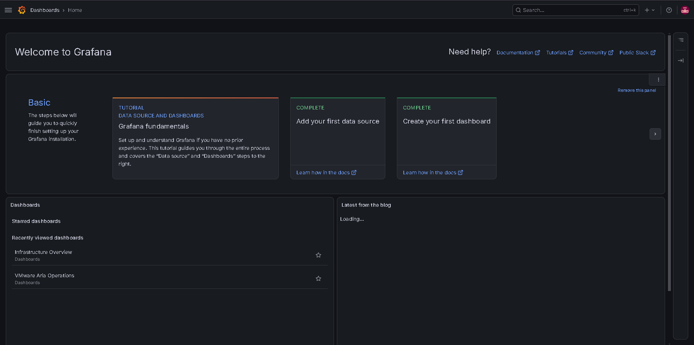
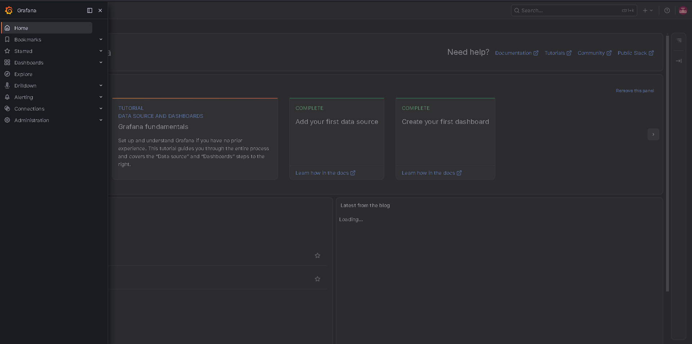
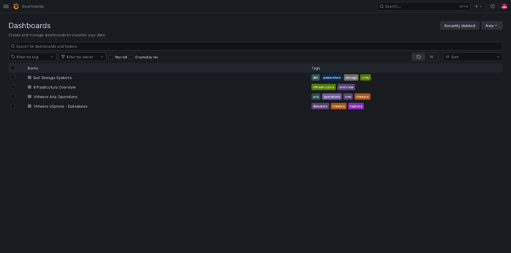
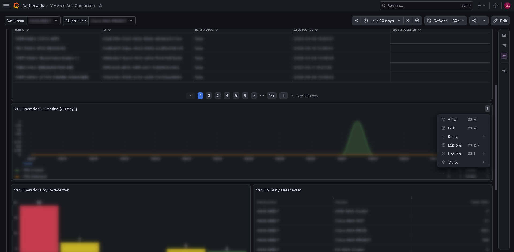
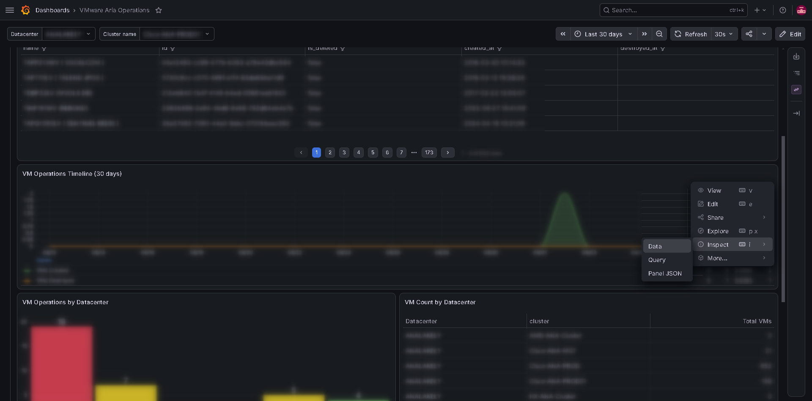
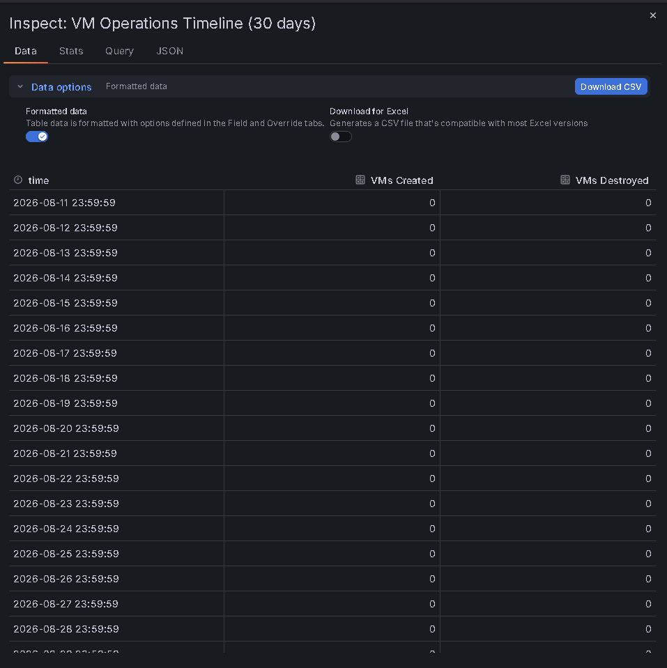

# Guide utilisateur Grafana

> **Navigation :** [README](../README.md) · [Index de la documentation](README.md) · [Documentation technique](DOCUMENTATION_TECHNIQUE.md) · [Détails des collecteurs](collector/)

### Accès à Grafana

1. **URL** : http://localhost:3000 ou http://<ip_de_la_machine_distant>:3000
2. **Identifiants** : Configurés dans `.env`
   ```
   ADMIN=votre_utilisateur
   PASSW=votre_motdepasse
   ```

### Dashboards disponibles

#### 1. **Infrastructure Overview**
- **Rôle** : Vue globale du datacenter
- **Métriques** : CPU, mémoire, datastores, VMs actives
- **Cas d'usage** : Monitoring en temps réel de la santé générale

#### 2. **VMware vSphere - Datastores**
- **Rôle** : Détails des datastores Unity et PowerStore
- **Métriques** : Utilisation (%), capacité totale/libre, IOPS
- **Cas d'usage** : Planification de capacité, alerte dégradation

#### 3. **Dell Storage Systems**
- **Rôle** : Performance des baies de stockage
- **Métriques** : Latence, débit, pool utilization (Unity/PowerStore)
- **Cas d'usage** : Diagnostique performance, SLA monitoring

#### 4. **VMware Aria Operations**
- **Rôle** : Inventory et cycle de vie des VMs
- **Métriques** : VM count, provisioning trends, cluster health
- **Cas d'usage** : Compliance, audit d'infrastructure

---

### Export CSV (Grafana)

#### Méthode native (tableaux Grafana)



1. Ouvrir un dashboard 
2. Cliquer sur le tableau que vous souhaitez exporter 
3. En haut à droite du panneau → **⋯ (menu)** → **Inspect** → **Data** 
4. Bouton **Download CSV** 
5. Les données sont exportées avec :
   - Les colonnes du tableau
   - Les valeurs à la dernière mise à jour
   - **Limitation** : ⚠️ Seules les lignes visibles et l'instant actuel (pas d'historique)

#### Limitation : Historique sur une plage temporelle

Grafana (version open-source) n'exporte que les données visibles à l'instant T.

---

### Données collectées et métriques

Chaque collecteur remonte des métriques dans InfluxDB sous forme de `measurements` (modèle de données détaillé dans la [documentation technique](DOCUMENTATION_TECHNIQUE.md#8-modèle-de-données-influxdb)) :

| Collecteur | Measurement | Champs clés |
|-----------|-------------|-----------|
| **Aria** | `cluster_metrics` | `cpu_capacity_usagepct_average`, `mem_host_usagePct`, `summary_total_number_vms` |
| **Aria** | `vm_lifecycle` | `is_deleted`, `created_at`, `destroyed_at` (cycle de vie des VMs) |
| **vSphere** | `datastore_usage` | `total_capacity`, `free_space`, `space_use`, `percent_use` |
| **Unity** | `unity_metrics` | Fields dynamiques (system, pools, LUNs, filesystems, disques, SP) |
| **PowerStore** | `powerstore_performance` | Fields dynamiques (espace cluster, performance noeuds/appliances) |

Pour requêter directement les données : l'API HTTP d'InfluxDB 3 est exposée sur le port 8181 (interface `http://localhost:8181`). Il n'y a pas de console web — utilisez l'API SQL (curl) ou les dashboards Grafana.

---

### Troubleshooting

**❌ Dashboard affiche "No data"**
- ✅ Vérifier que les collecteurs tournent : `docker ps`
- ✅ Relancer un collecteur : `make aria` ou `make one`
- ✅ Vérifier les logs : `docker logs aria_collector`

**❌ Connexion InfluxDB refusée**
- ✅ Vérifier le token dans `.env`
- ✅ Réinitialiser InfluxDB : `make clean && make start`

**❌ Graphiques ne se mettent pas à jour**
- ✅ Vérifier que Grafana peut atteindre InfluxDB
- ✅ Configuration → Data Sources → InfluxDB → Test Connection

---

### Cas d'usage courants

**Générer un rapport hebdomadaire de capacité**
1. Ouvrir **Dell Storage Systems** dashboard
2. Sélectionner la semaine dans le date picker (top-left)
3. Cliquer sur un panneau → Inspect → Data → **Download CSV**
4. Importer dans Excel/Sheets

**Alerter sur dégradation de performance**
- Utiliser Grafana **Alerting** (section **Alerting** → Alert rules → Create Rule)
- Intégration email/Slack (à configurer)

**Audit compliance**
- Exporter **VMware Aria Operations** dashboard
- Filtrer par cluster/datacenter via les variables
